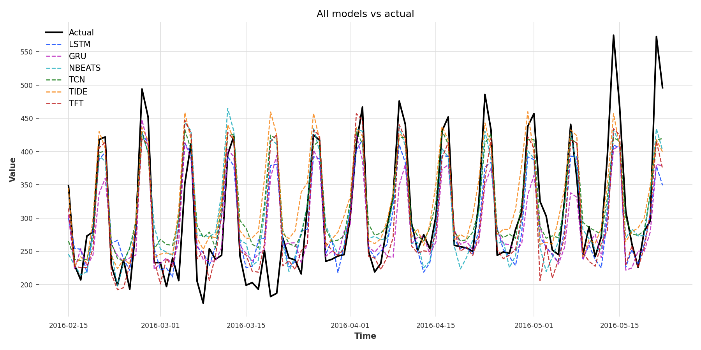

# Deep Learning Time Series Forecasting: Multi-Architecture Benchmark

> **Production-grade MLOps pipeline implementing and comparing 6 state-of-the-art deep learning architectures for time series forecasting**

[](https://www.python.org/downloads/)
[](https://pytorch.org/)
[](https://unit8co.github.io/darts/)
[](https://opensource.org/licenses/MIT)

A comprehensive deep learning forecasting system demonstrating expertise across **recurrent networks (LSTM, GRU)**, **convolutional architectures (TCN)**, **attention mechanisms (TFT)**, **interpretable models (N-BEATS)**, and **modern dense encoders (TiDE)**. Built with production-ready MLOps practices including automated hyperparameter optimization, config-driven experiments, and reproducible pipelines.

---

## Key Highlights

- **6 State-of-the-Art Architectures** – Implemented and benchmarked: LSTM, GRU, N-BEATS, TCN, TFT (Temporal Fusion Transformer), and TiDE
- **Deep Learning Expertise** – Demonstrates mastery of RNNs (sequential memory), CNNs (dilated convolutions), Transformers (multi-head attention), and interpretable neural blocks
- **Automated Hyperparameter Optimization** – Optuna-driven tuning with 50 trials per model using Tree-structured Parzen Estimator (TPE) and MedianPruner for efficient search
- **Production MLOps Pipeline** – Config-driven experiment orchestration, train-fit/test-transform scaling, early stopping, GPU auto-detection, and structured experiment tracking
- **Architectural Understanding** – Explicit handling of future vs. past covariates based on model architecture, L1Loss for outlier robustness, and proper time series cross-validation
- **Comprehensive Evaluation** – Multi-metric benchmarking (RMSE, MAE, MAPE, R²) with interpretable performance analysis across model families

---

## Quick Start

```bash
# 1. Install dependencies
pip install -r requirements.txt

# 2. Run a single experiment (e.g., LSTM)
python -m ts_dl_forecasting.cli --experiment config/experiment_lstm.yaml

# 3. View results
ls outputs/lstm/  # best_params.yaml, metrics.csv, forecast.csv
```

For batch experiments across all 6 models:
```bash
python -m ts_dl_forecasting.cli --batch config/experiments_batch.yaml --report
```

---

## What Problem Does This Solve?

Time series forecasting is critical for demand planning, inventory optimization, and revenue forecasting. This project tackles the **M5 Forecasting Challenge** (Walmart daily sales data), comparing how different deep learning architectures handle temporal patterns, seasonality, and exogenous covariates.

**Business Context**: Forecast 28-day ahead sales for a department-store combination using historical sales, pricing, calendar features (holidays, events), and promotional information.

**Technical Challenge**: Compare architectural paradigms (recurrence vs. convolution vs. attention) to understand performance-complexity tradeoffs in production settings.

---

## Benchmark Results

### Performance Comparison (28-Day Forecast Horizon)

| Model    | Architecture Type | RMSE ↓ | MAE ↓  | MAPE ↓ | R² ↑   |
|----------|-------------------|--------|--------|--------|--------|
| **TFT**  | Transformer       | 56.98  | **37.70** | **12.89%** | 0.646  |
| **LSTM** | RNN              | **56.52** | 39.47  | 13.45% | **0.651** |
| N-BEATS  | Interpretable     | 56.99  | 40.01  | 14.49% | 0.646  |
| TCN      | CNN              | 57.49  | 40.99  | 15.72% | 0.640  |
| TiDE     | Dense Encoder     | 60.68  | 42.70  | 16.07% | 0.598  |
| GRU      | RNN              | 60.77  | 44.24  | 14.53% | 0.597  |


*28-day forecast comparison: All models vs. actual sales (test set)*

### Key Insights

1. **Attention Wins on MAPE** – TFT achieves the best mean absolute percentage error (12.89%) by leveraging multi-head self-attention to capture complex covariate interactions and long-range dependencies. The temporal fusion decoder effectively combines past observations with future-known covariates (calendar features, promotions).

2. **LSTM Delivers Best R²** – Traditional LSTM provides the highest explained variance (R² = 0.651) with computational efficiency. Its gating mechanisms balance gradient flow for long sequences while avoiding the parameter overhead of attention layers.

3. **N-BEATS Interpretability** – Despite being purely univariate in this implementation (no covariates), N-BEATS achieves competitive performance (R² = 0.646) through its interpretable basis expansion that explicitly decomposes trend and seasonality components.

4. **TCN Fast Training** – Temporal Convolutional Network offers parallel training (non-sequential) with dilated causal convolutions covering long receptive fields. Performance (R² = 0.640) is competitive with faster convergence than RNNs.

5. **Architectural Tradeoffs** – GRU and TiDE underperform slightly, suggesting that for this particular seasonal pattern with strong calendar effects, sequential gating (LSTM) and explicit attention (TFT) outperform simplified recurrence (GRU) and pure dense architectures (TiDE).

---

## Deep Learning Models: Architecture Breakdown

| Model | Architecture Family | Key Mechanisms | Best Use Cases | Covariates |
|-------|---------------------|----------------|----------------|------------|
| **LSTM** | Recurrent Neural Network | Input/forget/output gates, cell state for long-term memory | General-purpose sequential forecasting, stable gradients | Future |
| **GRU** | Recurrent Neural Network | Simplified gating (reset/update), fewer parameters than LSTM | Efficient baseline, faster training for shorter sequences | Future |
| **N-BEATS** | Interpretable Neural Blocks | Doubly residual stacking, basis expansion (trend + seasonality) | Explainable forecasts, univariate series with clear decomposition | Past |
| **TCN** | Convolutional Neural Network | Dilated causal convolutions, exponentially growing receptive field | Parallel training, long sequences, non-sequential patterns | Past |
| **TFT** | Transformer (Attention) | Multi-head self-attention, gating mechanisms, temporal fusion decoder | Complex multivariate dependencies, interpretable attention weights | Future |
| **TiDE** | Dense Encoder-Decoder | Multi-layer perceptrons with residual connections, feature projection | Recent SOTA, handling high-dimensional feature spaces | Future |

### Architectural Deep Dive

**Future vs. Past Covariates**:
- **Future Covariates** (LSTM, GRU, TFT, TiDE): Models that can leverage features known at forecast time (e.g., calendar features, planned promotions, scheduled events). These models explicitly encode future information into the prediction process.
- **Past Covariates** (N-BEATS, TCN): Models that only use historical features not known in advance. Suitable for scenarios where future information is unavailable or when testing model robustness without leakage.

**Attention Mechanisms (TFT)**:
The Temporal Fusion Transformer uses multi-head self-attention to compute weighted relationships between all time steps, allowing it to focus on relevant historical periods and covariate combinations. This explains its superior MAPE performance on complex seasonal patterns.

**Dilated Convolutions (TCN)**:
TCN employs causal convolutions with exponentially increasing dilation rates, enabling each layer to capture broader temporal context without sequential dependencies, making it highly parallelizable during training.

**Interpretable Blocks (N-BEATS)**:
N-BEATS stacks residual blocks that emit basis function expansions (polynomial for trend, Fourier for seasonality), providing inherent interpretability unlike black-box RNNs or Transformers.

---

## Key Features

### MLOps & Experiment Management
- **3-Layer Config System**: Separation of data, model, and experiment configurations for reproducible research
- **Automated Hyperparameter Tuning**: Optuna with TPE sampler and MedianPruner for efficient search space exploration (50 trials per model)
- **Experiment Tracking**: Structured outputs with best hyperparameters (YAML), forecasts (CSV), and metrics (CSV) for each model
- **Batch Orchestration**: Run all 6 models sequentially with aggregated reporting and multi-model visualization

### Data Engineering & Preprocessing
- **Feature Engineering Pipeline**: Automated generation of calendar features (cyclical day-of-week, month encodings), event indicators (holidays, sporting events, religious events), and price covariates
- **Smart Scaling Strategy**: Separate StandardScaler for continuous variables (prices) and RobustScaler for target (sales, outlier-resistant), while preserving categorical features (calendar, events) unscaled
- **Train-Fit, Test-Transform**: Proper MLOps pattern—scalers fit only on training data, then transform validation/test to prevent data leakage
- **Darts TimeSeries Integration**: Automatic conversion to multivariate Darts TimeSeries with time-aligned covariates

### Model Training & Evaluation
- **GPU Auto-Detection**: Automatic CUDA utilization when available, graceful CPU fallback
- **Early Stopping**: Monitors training loss with configurable patience (default: 10 epochs, min_delta=1e-4) to prevent overfitting
- **L1Loss (MAE-based)**: Robust to outliers compared to L2Loss, critical for retail sales data with promotional spikes
- **Multi-Metric Evaluation**: RMSE (scale-dependent), MAE (interpretable), MAPE (percentage error), R² (explained variance)

### Extensibility & Code Quality
- **Factory Pattern**: Centralized `build_model()` function routes to model-specific builders, making it trivial to add new architectures
- **Covariate-Aware Tuning**: Optuna objectives automatically pass correct covariate types (future vs. past) based on model family
- **Reproducible Seeds**: All experiments use fixed random seeds (default: 3) for consistent results across runs
- **Modular Architecture**: Clear separation between data loading, model building, tuning, forecasting, and reporting

---

## Architecture & Pipeline Flow

```
┌─────────────────────────────────────────────────────────────────────────────┐
│                           DATA PREPARATION                                  │
└─────────────────────────────────────────────────────────────────────────────┘
                                      │
                      Raw M5 Data (sales, prices, calendar)
                                      │
                                      ▼
                          ┌──────────────────────┐
                          │   Preprocessing      │
                          │  (filter, reshape,   │
                          │   aggregate, join)   │
                          └──────────────────────┘
                                      │
                              data/processed/
                                      │
                                      ▼
                          ┌──────────────────────┐
                          │ Feature Engineering  │
                          │ (calendar, cyclical, │
                          │  events, lags)       │
                          └──────────────────────┘
                                      │
                         data/feature_engineering/
                          sales_forecast_features.csv
                                      │
┌─────────────────────────────────────────────────────────────────────────────┐
│                        EXPERIMENT PIPELINE                                  │
└─────────────────────────────────────────────────────────────────────────────┘
                                      │
                                      ▼
                          ┌──────────────────────┐
                          │  Dataset Builder     │
                          │ • Load CSV           │
                          │ • Convert to Darts   │
                          │ • Train/Valid/Test   │
                          │   Split              │
                          │ • Feature Scaling    │
                          └──────────────────────┘
                                      │
                  ┌───────────────────┴───────────────────┐
                  │                                       │
                  ▼                                       ▼
       ┌────────────────────┐               ┌────────────────────┐
       │  Future Covariates │               │  Past Covariates   │
       │  (calendar, price) │               │   (historical)     │
       │                    │               │                    │
       │  LSTM, GRU,        │               │  N-BEATS, TCN      │
       │  TFT, TiDE         │               │                    │
       └────────────────────┘               └────────────────────┘
                  │                                       │
                  └───────────────────┬───────────────────┘
                                      │
                                      ▼
                          ┌──────────────────────┐
                          │ Hyperparameter       │
                          │ Optimization (Optuna)│
                          │ • 50 trials          │
                          │ • TPE Sampler        │
                          │ • MedianPruner       │
                          └──────────────────────┘
                                      │
                              best_params.yaml
                                      │
                                      ▼
                          ┌──────────────────────┐
                          │  Model Retraining    │
                          │ • Train+Valid data   │
                          │ • Best params        │
                          │ • Early stopping     │
                          └──────────────────────┘
                                      │
                                trained_model.pth
                                      │
                                      ▼
                          ┌──────────────────────┐
                          │  Forecasting         │
                          │ • 28-day horizon     │
                          │ • Test set           │
                          │ • Inverse scaling    │
                          └──────────────────────┘
                                      │
                                      ▼
                          ┌──────────────────────┐
                          │  Evaluation          │
                          │ • RMSE, MAE          │
                          │ • MAPE, R²           │
                          └──────────────────────┘
                                      │
                                      ▼
                       outputs/{model_name}/metrics.csv
                                   forecast.csv
```

### 3-Layer Configuration System

The pipeline uses a hierarchical YAML configuration system for maximum flexibility and reproducibility:

**Layer 1: Data Configuration** (`config/data.yaml`)
```yaml
# Defines dataset paths, time series identifiers, target variable
dataset_path: data/feature_engineering/sales_forecast_features.csv
id_var: id              # Time series identifier
date_var: date          # Temporal index
target_var: sales       # Forecast target
forecast_horizon: 28    # Days ahead to predict
scale_vars:             # Variables to scale (continuous features)
  - sell_price
  - sales
```

**Layer 2: Model Configuration** (`config/model_lstm.yaml`)
```yaml
# Defines hyperparameter search space and training settings
model_name: lstm
tuning:
  n_trials: 50          # Optuna trials
  patience: 10          # Early stopping patience

hp_space:               # Hyperparameter search space
  lookback:
    type: choice
    values: [14, 21, 28]  # Input sequence length
  hidden:
    type: int
    low: 16
    high: 128             # LSTM hidden units
  lr:
    type: float
    low: 1e-4
    high: 1e-2
    log: true             # Log-uniform sampling
```

**Layer 3: Experiment Configuration** (`config/experiment_lstm.yaml`)
```yaml
# Orchestrates full pipeline by combining data + model
data_config: config/data.yaml
model_config: config/model_lstm.yaml
output_dir: outputs/lstm
```

This separation allows **mixing and matching**: the same data config can be used with any model, and model configs can be easily tuned independently.

---

## Technology Stack

### Deep Learning Frameworks
- **PyTorch 2.2.2** – Core deep learning backend with CUDA support
- **PyTorch Lightning 2.2.5** – Training loop abstraction with callbacks for early stopping and checkpointing
- **Darts 0.30.0** – Unified time series forecasting API wrapping PyTorch models (RNNModel, TCNModel, TFTModel, NBEATSModel, TiDEModel)

### Hyperparameter Optimization
- **Optuna 3.6.1** – Bayesian optimization framework
  - TPE (Tree-structured Parzen Estimator) sampler for efficient search
  - MedianPruner for early trial termination (halves computational cost)

### Data Processing & Feature Engineering
- **Pandas** – Time series manipulation, rolling windows, lag features
- **NumPy** – Numerical operations, cyclical encoding (sin/cos transformations)
- **scikit-learn** – StandardScaler, RobustScaler, train-test splitting

### Evaluation & Metrics
- **Darts Metrics** – Native RMSE, MAE, MAPE implementations for Darts TimeSeries
- **scikit-learn Metrics** – R² score for explained variance
- **Matplotlib + Seaborn** – Multi-model forecast visualization

### Experiment Management
- **PyYAML** – Configuration parsing and serialization
- **Structured Outputs** – JSON/CSV metrics, YAML hyperparameters, PNG plots

---

## Installation & Setup

### Prerequisites
- Python 3.8 or higher
- (Optional) CUDA-compatible GPU for accelerated training

### Standard Installation
```bash
# Clone the repository
git clone https://github.com/yedanzhang-ai/deep-learning-time-series-forecasting.git
cd deep-learning-time-series-forecasting

# Install dependencies
pip install -r requirements.txt
```

### Kaggle Notebook Installation
```python
# Upload requirements.txt as a dataset, then:
!pip install -q -r /kaggle/input/your-dataset/requirements.txt
```

### Verify Installation
```bash
python -m ts_dl_forecasting.cli --help
```

---

## Usage Examples

### 1. Single Model Experiment

Run LSTM with automated hyperparameter tuning:
```bash
python -m ts_dl_forecasting.cli --experiment config/experiment_lstm.yaml
```

**Expected Output:**
```
Loading experiment config: config/experiment_lstm.yaml
Building dataset from config/data.yaml...
Dataset shape: (1941, 15) | Train: 1857, Valid: 28, Test: 28
Starting Optuna tuning: 50 trials...
Trial 50/50 complete. Best MAE: 39.24
Retraining model with best hyperparameters...
Forecasting on test set (28 days)...
Evaluation metrics saved to outputs/lstm/metrics.csv
Forecast saved to outputs/lstm/forecast.csv
Best hyperparameters saved to outputs/lstm/best_params.yaml
```

**Output Files:**
- `outputs/lstm/metrics.csv` – RMSE, MAE, MAPE, R²
- `outputs/lstm/forecast.csv` – Date, actual sales, predicted sales
- `outputs/lstm/best_params.yaml` – Optimal lookback, hidden units, learning rate

### 2. Batch Experiments (All Models)

Run all 6 models and generate comparison report:
```bash
python -m ts_dl_forecasting.cli --batch config/experiments_batch.yaml --report
```

**Expected Output:**
```
Running batch experiments from config/experiments_batch.yaml
[1/6] Running LSTM...
[2/6] Running GRU...
[3/6] Running N-BEATS...
[4/6] Running TCN...
[5/6] Running TFT...
[6/6] Running TiDE...

Aggregating results...
Generating multi-model comparison plot...
Report saved to outputs/all_models_vs_actual.png

Summary:
+--------+-------+-------+-------+-------+
| Model  | RMSE  | MAE   | MAPE  | R²    |
+--------+-------+-------+-------+-------+
| LSTM   | 56.52 | 39.47 | 13.45 | 0.651 |
| TFT    | 56.98 | 37.70 | 12.89 | 0.646 |
| N-BEATS| 56.99 | 40.01 | 14.49 | 0.646 |
| TCN    | 57.49 | 40.99 | 15.72 | 0.640 |
| TiDE   | 60.68 | 42.70 | 16.07 | 0.598 |
| GRU    | 60.77 | 44.24 | 14.53 | 0.597 |
+--------+-------+-------+-------+-------+
```

### 3. Custom Output Directory

Organize experiments by date or version:
```bash
python -m ts_dl_forecasting.cli \
  --experiment config/experiment_tft.yaml \
  --output-root experiments/2024-01-15
```

Output will be saved to `experiments/2024-01-15/tft/`.

### 4. Data Preprocessing (From Raw M5 Data)

If starting from scratch with raw M5 Kaggle data:

```bash
# Step 1: Filter and aggregate raw data
python -m ts_dl_forecasting.preprocess_raw_data \
  --dept_id HOUSEHOLD_2 \
  --store_id CA_2 \
  --output_dir data/processed

# Step 2: Feature engineering (calendar, events, cyclical encoding)
python -m ts_dl_forecasting.feature_engineering \
  --config config/feature_engineering.yaml

# Step 3: Run experiments (as shown above)
python -m ts_dl_forecasting.cli --batch config/experiments_batch.yaml --report
```

**Note**: If you already have `data/feature_engineering/sales_forecast_features.csv`, you can skip directly to Step 3.

---

## Project Structure

```
deep-learning-time-series-forecasting/
│
├── config/                          # 3-layer YAML configuration system
│   ├── raw_data.yaml                # Raw data file paths, filtering
│   ├── data.yaml                    # Dataset paths, splits, scaling strategy
│   ├── feature_engineering.yaml     # Feature generation settings
│   ├── model_{lstm,gru,nbeats,tcn,tft,tide}.yaml  # Model-specific hp_space
│   ├── experiment_{lstm,gru,nbeats,tcn,tft,tide}.yaml  # Full experiments
│   └── experiments_batch.yaml       # Multi-model batch orchestration
│
├── data/
│   ├── raw/                         # Original M5 Kaggle files
│   ├── processed/                   # Cleaned, aggregated data
│   └── feature_engineering/         # Final feature matrix (sales_forecast_features.csv)
│
├── outputs/                         # Experiment results (auto-generated)
│   ├── {model_name}/
│   │   ├── best_params.yaml         # Optimal hyperparameters from Optuna
│   │   ├── metrics.csv              # RMSE, MAE, MAPE, R²
│   │   └── forecast.csv             # Date, actual, predicted
│   └── all_models_vs_actual.png     # Multi-model comparison plot
│
└── src/ts_dl_forecasting/
    ├── cli.py                       # Command-line interface (single/batch/report modes)
    ├── pipeline.py                  # Main experiment orchestrator
    ├── data.py                      # Dataset loading, splitting, scaling (Darts integration)
    ├── models.py                    # Model factory (LSTM, GRU, N-BEATS, TCN, TFT, TiDE builders)
    ├── tuning.py                    # Optuna objective functions, covariate-aware tuning
    ├── reporting.py                 # Metrics aggregation, multi-model plotting
    ├── feature_engineering.py       # Calendar, event, lag, rolling feature generation
    └── preprocess_raw_data.py       # Raw M5 data cleaning and aggregation
```

---

## Extending the Pipeline: Adding a New Model

The modular architecture makes adding new models straightforward. Example: Adding **Transformer** model.

### Step 1: Add Model Builder (`models.py`)

```python
def build_transformer_model(hp, forecast_horizon):
    """Build Transformer model with given hyperparameters."""
    from darts.models import TransformerModel

    return TransformerModel(
        input_chunk_length=hp["lookback"],
        output_chunk_length=forecast_horizon,
        d_model=hp["d_model"],
        nhead=hp["nhead"],
        num_encoder_layers=hp["num_encoder_layers"],
        num_decoder_layers=hp["num_decoder_layers"],
        dim_feedforward=hp["dim_feedforward"],
        dropout=hp["dropout"],
        activation="relu",
        loss_fn=torch.nn.L1Loss(),
        optimizer_kwargs={"lr": hp["lr"]},
        pl_trainer_kwargs={
            "accelerator": "gpu" if USE_GPU else "cpu",
            "devices": 1,
            "callbacks": [early_stop_callback],
        },
        random_state=hp.get("seed", 3),
    )
```

### Step 2: Update Model Factory (`models.py`)

```python
def build_model(model_name, hp, forecast_horizon, early_stop_callback=None):
    """Factory function routing to model-specific builders."""
    builders = {
        "lstm": build_lstm_model,
        "gru": build_gru_model,
        "nbeats": build_nbeats_model,
        "tcn": build_tcn_model,
        "tft": build_tft_model,
        "tide": build_tide_model,
        "transformer": build_transformer_model,  # NEW
    }

    if model_name not in builders:
        raise ValueError(f"Unknown model: {model_name}")

    return builders[model_name](hp, forecast_horizon, early_stop_callback)
```

### Step 3: Classify Covariate Type (`tuning.py` and `pipeline.py`)

```python
# Add to FUTURE_COV_MODELS if model uses future covariates,
# or to PAST_COV_MODELS if it uses past covariates
FUTURE_COV_MODELS = {"gru", "lstm", "tide", "tft", "transformer"}  # NEW
PAST_COV_MODELS = {"nbeats", "tcn"}
```

### Step 4: Create Config Files

**`config/model_transformer.yaml`:**
```yaml
model_name: transformer
tuning:
  n_trials: 50
  patience: 10

hp_space:
  lookback:
    type: choice
    values: [14, 21, 28]
  d_model:
    type: choice
    values: [64, 128, 256]
  nhead:
    type: choice
    values: [4, 8]
  num_encoder_layers:
    type: int
    low: 2
    high: 4
  num_decoder_layers:
    type: int
    low: 2
    high: 4
  dim_feedforward:
    type: int
    low: 128
    high: 512
  dropout:
    type: float
    low: 0.1
    high: 0.3
  lr:
    type: float
    low: 1e-4
    high: 1e-2
    log: true
  seed: 3
```

**`config/experiment_transformer.yaml`:**
```yaml
data_config: config/data.yaml
model_config: config/model_transformer.yaml
output_dir: outputs/transformer
```

### Step 5: Run Experiment

```bash
python -m ts_dl_forecasting.cli --experiment config/experiment_transformer.yaml
```

The pipeline automatically handles:
- Optuna hyperparameter search
- Covariate passing (future covariates for Transformer)
- Early stopping
- Metrics computation and saving

---

## Design Decisions & MLOps Best Practices

### Why L1Loss Instead of L2Loss?

**Choice**: Mean Absolute Error (L1Loss) over Mean Squared Error (L2Loss)

**Rationale**:
- Retail sales data contains outliers (e.g., promotional spikes, Black Friday)
- L2Loss (MSE) squares errors, heavily penalizing outliers → model overfits to extreme events
- L1Loss (MAE) treats all errors linearly → more robust to anomalies
- MAE is interpretable in original units (dollars of sales error)

**Trade-off**: L1Loss sacrifices smoothness (not differentiable at zero) but gains robustness, which is critical for real-world forecasting.

### Scaling Strategy: Two-Tier Approach

**Continuous Variables** (sell_price, sales): Scaled with `StandardScaler` or `RobustScaler`
- Reason: Neural networks converge faster with normalized inputs (mean=0, std=1)
- RobustScaler for target variable (sales) uses median and IQR → less sensitive to outliers

**Categorical Variables** (event flags): Kept unscaled
- Reason: These are already binary (event flags)
- Scaling would lose interpretability without improving convergence

**Cyclical Encoding** (day_of_week, month): Transformed to sin/cos pairs
- Reason: Preserves circular nature (Monday is close to Sunday, December wraps to January)
- Example: `day_sin = sin(2π × day / 7)`, `day_cos = cos(2π × day / 7)`

### Reproducibility: Seed Management

All experiments use a fixed random seed (default: 3) applied to:
- PyTorch random number generator (`torch.manual_seed`)
- NumPy random state
- Train/validation split (Darts `TimeSeries` slicing is deterministic given the same split points)
- Model weight initialization

**Result**: Identical hyperparameters → identical results across runs, enabling reproducible research.

### Train-Fit, Valid/Test-Transform Pattern

**Critical MLOps Practice**: Prevent data leakage

```python
# CORRECT
scaler = StandardScaler()
train_scaled = scaler.fit_transform(train)  # Fit on train
valid_scaled = scaler.transform(valid)      # Transform only
test_scaled = scaler.transform(test)        # Transform only

# INCORRECT (leakage)
all_data_scaled = scaler.fit_transform(all_data)  # Sees future!
```

**Why**: If scaler fits on validation/test data, it "sees the future" (mean and std are contaminated), leading to overly optimistic performance.

### Future vs. Past Covariates: Model-Specific Logic

**Architectural Constraint**:
- **Autoregressive models** (LSTM, GRU, TFT, TiDE): Can consume future covariates because they generate predictions step-by-step, conditioning each step on known future features
- **Non-autoregressive models** (N-BEATS, TCN): Only use past covariates because they generate all forecast steps simultaneously without iterative conditioning

**Implementation**:
```python
# In tuning.py and pipeline.py
if model_name in FUTURE_COV_MODELS:
    model.fit(train, future_covariates=train_cov)
    pred = model.predict(n=horizon, future_covariates=test_cov)
elif model_name in PAST_COV_MODELS:
    model.fit(train, past_covariates=train_cov)
    pred = model.predict(n=horizon, past_covariates=test_cov)
```

This explicit handling ensures each model receives the architecturally appropriate covariate format.

### Early Stopping: Balancing Fit and Generalization

**Configuration**:
- Monitor: `train_loss` (could be extended to validation loss for stricter stopping)
- Patience: 10 epochs (model-configurable)
- Min delta: 1e-4 (ignores improvements smaller than 0.0001)

**Rationale**:
- Prevents overfitting to training data
- Saves computational cost (50 Optuna trials × max 100 epochs = up to 5000 training epochs per model)
- PyTorch Lightning callback handles checkpointing automatically (restores best weights)

**Trade-off**: Monitoring `train_loss` is less strict than `val_loss` but avoids double-dipping into the validation set during tuning (Optuna already uses validation MAE as objective).

### MedianPruner: Efficient Hyperparameter Search

**Optuna Pruning Strategy**:
- After each epoch, compare trial's performance to median of all previous trials at that epoch
- If trial is underperforming (above median loss), terminate early
- Typical speedup: 2-3x fewer epochs per tuning run

**Example**: If 30 trials have median MAE = 45.0 at epoch 5, and a new trial has MAE = 60.0, it's pruned (won't reach competitive performance).

### Config Versioning & Experiment Tracking

**Reproducibility Through Config Snapshots**:
- Every experiment references specific config files (data.yaml, model_lstm.yaml, etc.)
- Best hyperparameters saved as `best_params.yaml` in output directory
- Git commit hash could be added to output metadata for full provenance

**Future Extension**: Integration with MLflow or Weights & Biases for:
- Automatic experiment logging
- Hyperparameter comparison dashboard
- Model registry and versioning

---

## Author & Contact

**Yedan Zhang** (yedanzhang-ai)
Data Science Architect | Deep Learning & Production ML Systems

**Expertise**: Multi-Architecture Neural Network Design, Time Series Forecasting, MLOps Pipeline Engineering, Hyperparameter Optimization, Technical Leadership

**GitHub**: [github.com/yedanzhang-ai](https://github.com/yedanzhang-ai)
**LinkedIn**: [linkedin.com/in/yedanzhang](https://linkedin.com/in/yedanzhang)

*Building production ML systems at scale. Interested in deep learning research, MLOps engineering, and technical leadership roles.*

---

## License

This project is licensed under the **MIT License** – see the [LICENSE](LICENSE) file for details.

You are free to use, modify, and distribute this code for commercial or non-commercial purposes with attribution.

---

## Acknowledgments

- **M5 Forecasting Competition** (Kaggle) – Dataset and problem formulation
- **Darts Library** – Unified time series forecasting API
- **Optuna Team** – Efficient hyperparameter optimization framework
- **PyTorch & PyTorch Lightning** – Deep learning infrastructure

---

**If this project helps your research or portfolio, please star ⭐ the repository!**

For questions, issues, or collaboration inquiries, please open a GitHub issue or reach out via LinkedIn.
